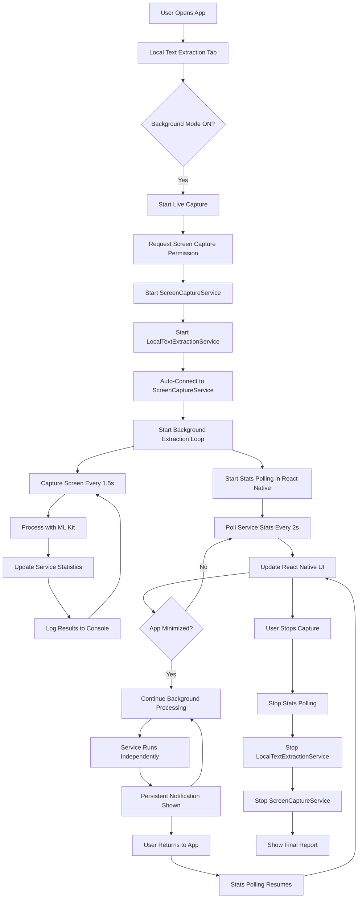
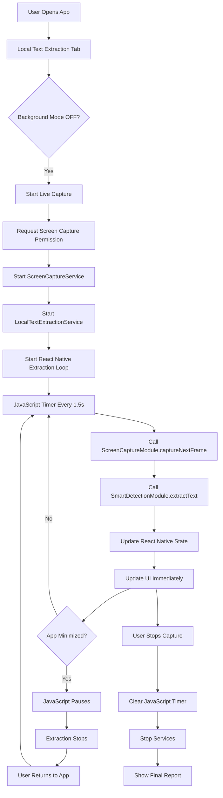

# 🔍 Live Text Extraction App Flow

## 📱 **Current Architecture Overview**

The app now supports two modes of operation: **Foreground Mode** (traditional) and **Background Mode** (new enhanced version).

---

## 🌙 **Background Mode Flow (Default & Recommended)**



---

## 📱 **Foreground Mode Flow (Legacy)**



---

## 🏗️ **Detailed Component Architecture**

### **React Native Layer**
```
┌─────────────────────────────────────────┐
│           React Native App              │
├─────────────────────────────────────────┤
│  • local-text-extraction.tsx           │
│  • State Management (useState)          │
│  • Stats Polling (useRef + setInterval) │
│  • UI Updates & User Interactions       │
└─────────────────────────────────────────┘
                    │
                    ▼
┌─────────────────────────────────────────┐
│         Native Module Bridge           │
├─────────────────────────────────────────┤
│  • LocalTextExtractionModule.kt        │
│  • ScreenCaptureModule.kt              │
│  • SmartDetectionModule.kt             │
└─────────────────────────────────────────┘
```

### **Android Service Layer**
```
┌─────────────────────────────────────────┐
│        LocalTextExtractionService      │
├─────────────────────────────────────────┤
│  • Foreground Service                  │
│  • Auto-starts extraction loop         │
│  • Connects to ScreenCaptureService    │
│  • Tracks statistics                   │
│  • Persistent notification             │
│  • Wake lock management                │
└─────────────────────────────────────────┘
                    │
                    ▼
┌─────────────────────────────────────────┐
│         ScreenCaptureService           │
├─────────────────────────────────────────┤
│  • MediaProjection management          │
│  • Screen capture every 1.5s           │
│  • Frame buffering                     │
│  • Background operation support        │
└─────────────────────────────────────────┘
```

### **ML Processing Layer**
```
┌─────────────────────────────────────────┐
│           ML Kit Integration           │
├─────────────────────────────────────────┤
│  • LocalTextExtractor.kt              │
│  • On-device text recognition          │
│  • Confidence scoring                  │
│  • Text region detection               │
│  • Validation & quality checks         │
└─────────────────────────────────────────┘
```

---

## 🔄 **Data Flow Sequence**

### **Background Mode Sequence**
```
User Action → React Native → Native Module → Service → ML Kit → Statistics → Polling → UI Update
     │              │              │           │        │          │           │         │
     │              │              │           │        │          │           │         │
     ▼              ▼              ▼           ▼        ▼          ▼           ▼         ▼
1. Tap Start → 2. Call Native → 3. Start → 4. Auto → 5. Process → 6. Update → 7. Poll → 8. Show
   Button         Method          Service    Connect   Frame      Stats       Every 2s   Stats
```

### **Key Differences Between Modes**

| Aspect | Background Mode | Foreground Mode |
|--------|----------------|-----------------|
| **Processing** | Android Service | React Native JavaScript |
| **App Minimized** | ✅ Continues | ❌ Pauses |
| **Performance** | Consistent | Variable |
| **Battery** | Optimized | Higher usage |
| **Stats Updates** | Polling (2s) | Direct |
| **Notification** | Persistent | None |
| **Independence** | Fully independent | App-dependent |

---

## 🎯 **Current Flow Benefits**

### **Background Mode Advantages:**
- ✅ **True background operation** - works when app is minimized
- ✅ **Consistent performance** - not affected by React Native lifecycle
- ✅ **Battery optimized** - uses Android's native service architecture
- ✅ **Real-time stats** - UI updates via polling
- ✅ **User control** - notification with stop button
- ✅ **Robust error handling** - service-level retry logic

### **Implementation Highlights:**
- **Auto-connection**: Service automatically connects to screen capture
- **Stats polling**: React Native polls service every 2 seconds for updates
- **Lifecycle independence**: Extraction continues regardless of app state
- **Memory efficient**: Uses Android's optimized service architecture
- **User-friendly**: Clear notifications and UI feedback

---

## 📊 **Statistics Flow**

```
Service Statistics → Native Module Bridge → React Native Polling → UI Updates
        │                      │                     │                │
        ▼                      ▼                     ▼                ▼
   • totalCaptures        • getLocalText        • setInterval     • setCaptureStats
   • successfulExtractions  ExtractionStats      (every 2s)       • Real-time display
   • averageConfidence    • Promise-based       • Error handling  • Performance metrics
   • totalTextExtracted    API calls           • Background-safe  • User feedback
   • processingTime       • Type-safe data      • Automatic retry • Visual indicators
```

This architecture provides a robust, efficient, and user-friendly live text extraction system that works seamlessly in both foreground and background modes!

